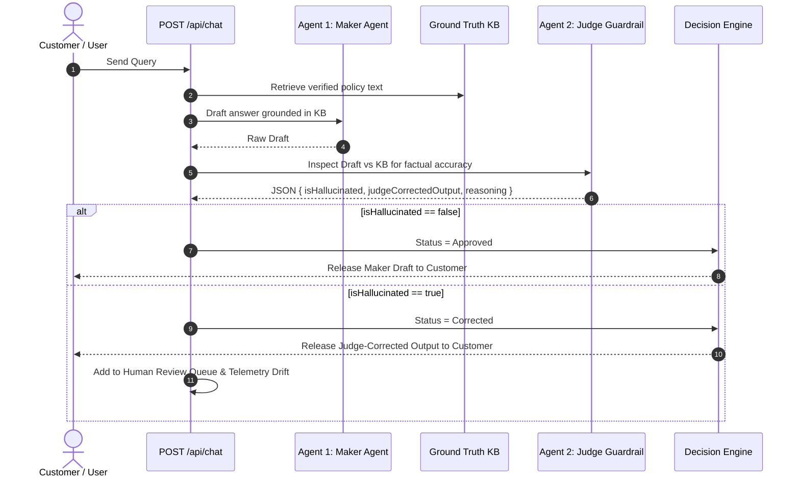

# VeriTrust AI — Developer & Maintainer Guide 🛠️

> **For Engineers, Judges & Future Maintainers**: This guide explains the codebase structure, how the real-time Dual-Agent pipeline operates, how security and API keys are managed, and how to debug or extend any part of the system.

---

## 1. Directory Structure

```text
veritrust-ai/
├── backend/
│   ├── app/
│   │   ├── agents/
│   │   │   ├── maker.py             # Agent 1 (Generative RAG drafter)
│   │   │   ├── judge.py             # Agent 2 (Claim extraction & entailment verification)
│   │   │   └── graph.py             # LangGraph StateGraph orchestration loop
│   │   ├── routes/
│   │   │   ├── chat.py              # Main Dual-Agent chat endpoint & direct Gemini cascade
│   │   │   ├── knowledge.py         # Knowledge base document indexing & management
│   │   │   ├── metrics.py           # Real-time telemetry, accuracy drift & latency tracking
│   │   │   ├── review.py            # Human review queue & rule-learning overrides
│   │   │   └── workspaces.py        # Multi-tenant organization & isolation manager
│   │   ├── models/
│   │   │   └── schemas.py           # Pydantic v2 data models, claim contracts & API schemas
│   │   ├── services/
│   │   │   ├── metrics_tracker.py   # In-memory + rolling telemetry calculation
│   │   │   ├── review_service.py    # Flagged interaction persistence & rule learning
│   │   │   ├── workspace_service.py # Multi-tenant isolation & safe key management
│   │   │   └── file_security.py     # Document upload scanning & validation
│   │   ├── knowledge/
│   │   │   ├── vectorstore.py       # ChromaDB vector index with fallback embeddings
│   │   │   ├── loader.py            # Document chunker & seed loader
│   │   │   └── documents/           # Seed policy documents for default demo benchmark
│   │   ├── config.py                # Pydantic BaseSettings & CORS configuration
│   │   └── main.py                  # FastAPI application entrypoint & middleware
│   ├── requirements.txt             # Python dependencies
│   ├── .env.example                 # Clean template with placeholders (no real secrets)
│   └── .gitignore                   # Ignores .env, *.key, and local DBs
│
├── frontend/
│   ├── src/
│   │   ├── components/
│   │   │   ├── chat/                # ChatView, MessageBubble, ChatInput, StatusChip
│   │   │   ├── judge/               # JudgePanel, ClaimCard, VerificationTimeline
│   │   │   ├── layout/              # Header (responsive), Sidebar, Layout wrapper
│   │   │   ├── metrics/             # MetricsDashboard, DriftChart, MetricTile
│   │   │   ├── comparison/          # ComparisonView (side-by-side Maker vs Judge)
│   │   │   ├── knowledge/           # KnowledgeBaseView, DocumentCard
│   │   │   ├── review/              # ReviewQueueView (Human-in-the-Loop review)
│   │   │   └── ui/                  # NeuCard (with Liquid Glass), NeuButton, NeuBadge
│   │   ├── context/
│   │   │   ├── WorkspaceContext.tsx # Enterprise multi-tenant active workspace
│   │   │   ├── AuditContext.tsx     # Central pendingAudits state for badges & review
│   │   │   └── SidebarContext.tsx   # Sidebar collapse/expand state
│   │   ├── hooks/                   # useChat, useMetrics, useLLMHealth, useConnectionStatus
│   │   ├── services/
│   │   │   ├── api.ts               # Typed REST API & WebSocket client
│   │   │   └── mockData.ts          # Offline fallback benchmark data
│   │   ├── types/                   # TypeScript interfaces matching backend schemas
│   │   └── index.css                # Neumorphic styling + Apple Liquid Glass theme
│   ├── package.json                 # Node dependencies
│   └── vite.config.ts               # Vite bundler configuration & dev server proxy
│
├── README.md                        # Project overview & problem statement
├── DEVELOPER_GUIDE.md               # This developer guide
└── .gitignore                       # Global secrets & build artifact exclusion
```

---

## 2. Security & API Keys Architecture

### Zero Secret Exposure Policy
- **Never commit `.env`**: Both root `.gitignore` and `backend/.gitignore` strictly ignore `.env`, `.env.*`, `*.pem`, `*.key`, and `secrets/`.
- **Masking in logs & responses**:
  - `mask_secret_key()` in `backend/app/routes/chat.py` formats keys as `k[:4]...k[-4:]` for diagnostic logs.
  - `mask_key()` in `backend/app/services/workspace_service.py` ensures that workspace settings returned to the frontend **never** expose the raw API key.
- **Render Deployment**: On Render, the `GEMINI_API_KEY` is provided as an **Environment Variable** inside the Render Dashboard (`veritrust-ai` backend service &rarr; Environment &rarr; `GEMINI_API_KEY`), never checked into version control.

---

## 3. The Dual-Agent Pipeline

### Flow Diagram


### Automatic Model Cascade
To protect against rate limits (429) or transient cloud outages (503), `call_gemini_direct()` in `chat.py` cascades through Google's models:
1. `gemini-flash-lite-latest` (fastest latency, ~300ms)
2. `gemini-3.5-flash-lite` (stable alternative)
3. `gemini-3.1-flash-lite` (fallback)
4. `gemini-3.8-flash` (standard tier)

If all cloud models are unreachable or if running in an offline sandbox, the backend automatically transitions to the **Deterministic Grounded Fallback Engine** (`[Deterministic Check]`), which validates claim parameters using regex rules.

---

## 4. Troubleshooting & Debugging

| Symptom | Cause | Solution |
| :--- | :--- | :--- |
| **"Offline Grounded Fallback" badge in chat** | `GEMINI_API_KEY` is missing, expired, or network is blocked. | Verify `GEMINI_API_KEY` in `backend/.env` or Render Dashboard Environment Variables. |
| **CORS errors in browser console** | Frontend origin is not in the whitelist. | Add your domain to `ALLOWED_ORIGINS` in `backend/app/config.py` or set `ALLOWED_ORIGINS` env var. |
| **503 Service Unavailable from Gemini** | Upstream Google model is temporarily overloaded. | The cascade automatically handles this. You can re-order model preferences in `chat.py` line 83. |
| **Vite build TypeScript error** | Schema mismatch between frontend types and backend responses. | Run `npm run build` in `frontend/`. Check `src/types/index.ts` to ensure fields match `schemas.py`. |
| **Review queue item count discrepancy** | Unsaved review queue items. | `AuditContext.tsx` handles real-time additions via `addPendingAudit()` and merges them with backend queue data. |

---

## 5. Running Locally

### Backend Setup
```bash
cd backend
python -m venv .venv
source .venv/bin/activate   # On Windows: .venv\Scripts\activate
pip install -r requirements.txt
cp .env.example .env        # Fill in your GEMINI_API_KEY
uvicorn app.main:app --reload --port 8000
```
- Interactive Swagger docs: [http://localhost:8000/docs](http://localhost:8000/docs)
- Health check: [http://localhost:8000/health](http://localhost:8000/health)

### Frontend Setup
```bash
cd frontend
npm install
npm run dev
```
- Dashboard runs at [http://localhost:5173](http://localhost:5173) (auto-proxies `/api` to port 8000).
- Production build: `npm run build`

---

## 6. Extending the System

### Adding a New Evaluation Workspace / Company
1. Click **+ Add New Company** in the top navigation bar.
2. Enter the company name, industry, and paste or upload their policy documents.
3. The system creates an isolated vector namespace in ChromaDB. Maker and Judge will now ground and verify answers strictly against that company's specific policies.
