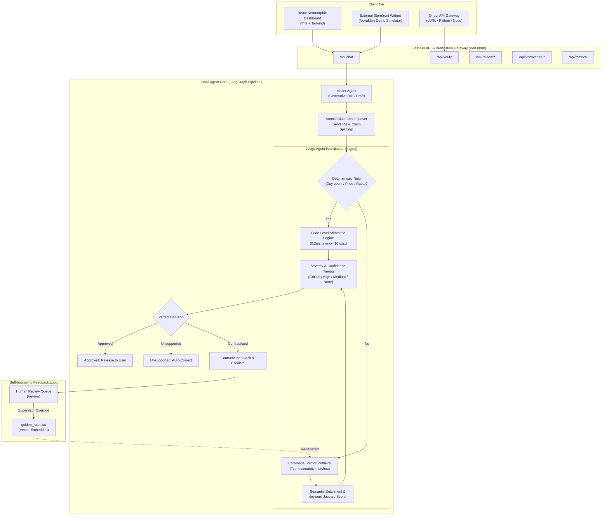

# VeriTrust AI 🛡️
### Real-Time Dual-Agent "Maker & Judge" Hallucination Guardrail System
**GDG on Campus GRIET — AI & Machine Learning Track**

---

## 1. Executive Summary & Problem Framing

> *"A customer support bot that promises a 60-day refund window when corporate policy says 30 days looks exactly as confident as a correct answer. At the point of delivery, nothing distinguishes an AI hallucination from the truth."*

Frontier LLMs have hallucination rates ranging from **22% to 94%** (Stanford 2026 AI Index). When deployed in automated customer workflows, single-agent architectures routinely invent non-existent warranties, fabricate discount codes, contradict delivery timelines, and create severe commercial and legal liabilities.

**VeriTrust AI** is a real-time compliance filter that intercepts customer service AI outputs **before they reach the client**. Rather than relying on another vague "LLM vibe-check", VeriTrust implements an automated reasoning architecture:
1. **Maker Agent**: Drafts natural, conversational responses grounded in retrieved knowledge base chunks.
2. **Judge Agent**: Intercepts the draft, decomposes it into discrete atomic claims, verifies each claim against verified source sentences, and scores entailment deterministically.
3. **Decision Branch**:
   - **Approved**: All factual claims verified against source docs &rarr; Released to customer.
   - **Corrected**: Non-critical unsupported claims or pricing errors &rarr; Auto-corrected with verified data & re-verified.
   - **Blocked**: Direct policy contradictions or fabricated promises &rarr; Stopped, escalated to human team with safe fallback.

> [!NOTE]
> **Data Source & Synthetic Benchmark Disclosure**: VeriTrust AI is demonstrated using "NovaMart" — an original, synthetic retail company with sample return, shipping, warranty, and pricing policies written specifically for this hackathon evaluation. It is not real data from an actual third-party retailer. The dual-agent verification engine is fully functional and supports dropping in any enterprise's real corporate policy documents via the multi-tenant workspace switcher.

---

## 2. System Architecture



---

## 3. What Makes VeriTrust AI Different? (Innovation Defense)

| Dimension | Shallow "LLM-as-Judge" | VeriTrust AI Guardrail |
| :--- | :--- | :--- |
| **Verification Logic** | Single vague prompt: *"Is this text accurate?"* | **Claim Decomposition**: Breaks drafts into checkable units, separating conversational filler from factual assertions. |
| **Deterministic Checking** | Probabilistic guess | **Code-Level Arithmetic Engine**: Verifies day counts (60 vs 30 days), dollar amounts ($9.99 vs $15.99), and percentages using arithmetic validation ($0.00\text{ cost}$, $0.2\text{ms}$). |
| **Audit Trace & Explainability** | Generic score | **Retrieval Audit Trace**: Displays candidate chunks, semantic match %, keyword Jaccard overlap, and deterministic overrides. |
| **Self-Improving Loop** | Static rulebook | **Supervisor Auto-Indexing**: Promoted human resolutions are immediately embedded into `golden_rules.txt` and indexed in ChromaDB. |
| **Integration Flexibility** | Internal playground only | **Standalone Gateway & Storefront Simulator**: Drop-in `POST /api/verify` endpoint and mock customer widget simulator. |

---

## 4. Repository Layout

```
veritrust-ai/
├── run_demo.sh                 # Single-command launcher for both backend & frontend
├── README.md                   # Complete system overview & quick start
├── LICENSE                     # MIT Open Source License
├── .gitignore                  # Git exclusions (build artifacts, virtualenv, caches)
├── docs/                       # Specifications and Guides
│   ├── PRD.md                  # Complete Product Requirements Document
│   ├── ARCHITECTURE.md         # Full architectural deep dive & data flow
│   ├── JUDGE_DEMO_GUIDE.md     # 3-minute hackathon demo script
│   └── COLOR_SYSTEM.md         # Multi-hue soft neumorphic palette guide
├── backend/                    # FastAPI Backend & AI Agents
│   ├── app/
│   │   ├── main.py             # FastAPI entrypoint & fallback static mount
│   │   ├── config.py           # Application settings
│   │   ├── agents/
│   │   │   ├── maker.py        # Maker Agent with RAG & demo triggers
│   │   │   ├── judge.py        # Judge Agent with deterministic arithmetic & claim scorer
│   │   │   └── graph.py        # LangGraph StateGraph pipeline
│   │   ├── knowledge/
│   │   │   ├── documents/      # Ground truth documents & golden_rules.txt
│   │   │   ├── loader.py       # Chunking and embedding loader
│   │   │   └── vectorstore.py  # ChromaDB vector store
│   │   ├── models/
│   │   │   └── schemas.py      # Pydantic schemas (Claims, Verdicts, Reviews, Metrics)
│   │   ├── routes/
│   │   │   ├── chat.py         # /api/chat & /api/chat/compare
│   │   │   ├── verify.py       # Standalone /api/verify gateway
│   │   │   ├── review.py       # /api/review/* queue & supervisor overrides
│   │   │   ├── metrics.py      # /api/metrics telemetry & drift
│   │   │   └── knowledge.py    # /api/knowledge/* documents & re-indexing
│   │   └── services/
│   │       ├── metrics_tracker.py # Telemetry tracker with drift time-series
│   │       └── review_service.py # Review queue & golden rule indexing
│   ├── requirements.txt        # Python dependencies
│   └── .env.example            # Environment variables template
└── frontend/                   # React + TypeScript + Vite Dashboard
    ├── src/
    │   ├── components/
    │   │   ├── chat/           # ChatView, MessageBubble, ChatInput, StatusChip
    │   │   ├── judge/          # JudgePanel, ClaimCard, VerificationTimeline
    │   │   ├── review/         # ReviewQueueView (Human-in-the-loop supervisor queue)
    │   │   ├── integration/    # IntegrationView & Storefront Simulator
    │   │   ├── comparison/     # ComparisonView (Maker vs Maker+Judge)
    │   │   ├── metrics/        # MetricsDashboard, DriftChart, ClaimBreakdownChart
    │   │   ├── knowledge/      # KnowledgeBaseView, DocumentCard
    │   │   ├── layout/         # Responsive Sidebar, Header, Layout
    │   │   └── ui/             # NeuCard, NeuButton, NeuBadge, NeuInput, NeuToggle
    │   ├── context/            # SidebarContext, WorkspaceContext
    │   ├── hooks/              # useChat, useMetrics
    │   ├── services/           # api.ts (Backend client + offline fallback)
    │   ├── types/              # TypeScript interfaces
    │   ├── App.tsx             # Route configuration
    │   └── index.css           # Multi-hue soft neumorphic styling tokens
    ├── package.json            # Node dependencies
    ├── vite.config.ts          # Vite build & proxy setup
    └── .env.example            # Frontend environment template
```

---

## 5. How to Run

### Quick Start (Single Command)
```bash
git clone <repository-url>
cd veritrust-ai
./run_demo.sh
```

### URLs:
- ** https://veritrust-ai-gdgoc.onrender.com **

- ### PREVIEW:
  
- ### LIVE GUARDRAIL SESSION PAGE
- 

- ### MAKER VS JUDGE
-

- ### STRESS TEST 
-


