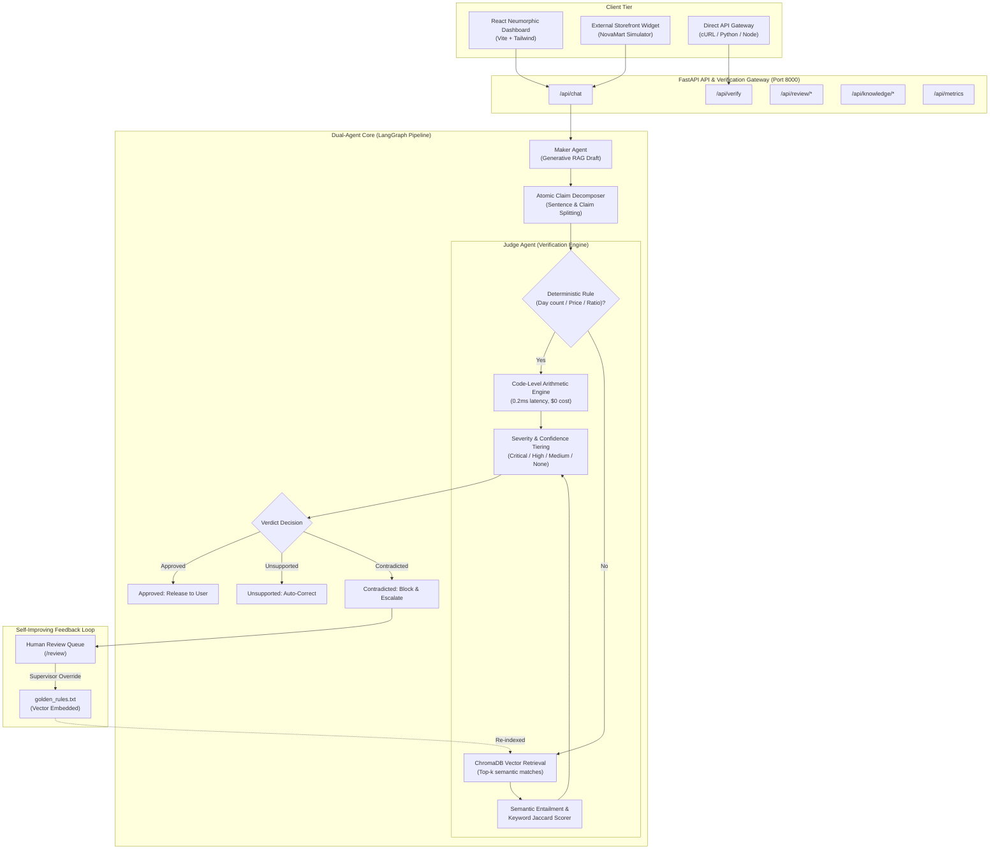

# VeriTrust AI — System Architecture & Implementation

VeriTrust AI is an in-line, dual-agent hallucination interception system designed to prevent LLMs from delivering ungrounded, contradicted, or fabricated claims to end users in customer-facing applications.



---

## 1. Core Modules

### 1.1 Maker Agent (`backend/app/agents/maker.py`)
- Retrieves top-k policy documents from the active workspace in ChromaDB.
- Drafts a helpful response to the user's query.
- In Demo mode, contains deterministic trigger scenarios (such as claiming 60-day return windows, $9.99 shipping pricing, or coupon stacking) to allow repeatable, transparent live demonstration.

### 1.2 Claim Decomposition & Judge Agent (`backend/app/agents/judge.py`)
- **Decomposition**: Splits incoming AI response into atomic factual claims while filtering conversational filler phrases.
- **Deterministic Check Engine**: Evaluates numerical quantities (e.g. `60 days` vs `30 days`, `$9.99` vs `$15.99`, warranty durations) with strict mathematical comparisons.
- **Semantic Entailment**: Computes cosine similarity across ChromaDB vector embeddings combined with Jaccard token overlap.
- **Retrieval Trace**: Collects full telemetry on every claim: candidates retrieved, latency in milliseconds, winner vs runner-up scores, and method used.

### 1.3 Human-in-the-Loop Review & Self-Improving Loop (`backend/app/services/review_service.py`)
- High-severity blocked interactions are routed to `/api/review/queue`.
- Supervisors can approve guardrail corrections or provide custom authoritative overrides.
- Upon supervisor resolution with `add_to_knowledge_base=True`, the approved response is appended to `golden_rules.txt` and ChromaDB is re-indexed immediately.

---

## 2. Directory Structure

```
veritrust-ai/
├── backend/
│   ├── app/
│   │   ├── agents/          # Maker, Judge, and LangGraph pipeline
│   │   ├── knowledge/       # ChromaDB vector store and loader
│   │   │   └── documents/   # Markdown/Text ground truth policies
│   │   ├── models/          # Pydantic schemas (Claims, Verdicts, Reviews)
│   │   ├── routes/          # Chat, Verify, Knowledge, Review, Metrics API
│   │   ├── services/        # Review service & in-memory metrics tracker
│   │   ├── config.py        # App configuration & settings
│   │   └── main.py          # FastAPI application & static mount
│   ├── requirements.txt     # Python backend dependencies
│   ├── .env.example         # Environment variables template
│   └── .venv/               # Virtualenv
├── frontend/
│   ├── public/              # Icons, favicons, metadata
│   ├── src/
│   │   ├── components/      # Chat, Judge, Layout, Review, Metrics, Integration
│   │   ├── context/         # SidebarContext & WorkspaceContext
│   │   ├── hooks/           # useChat, useMetrics
│   │   ├── services/        # API client & mock datasets
│   │   ├── types/           # TypeScript data interfaces
│   │   ├── App.tsx          # Router configuration
│   │   ├── index.css        # Multi-hue soft neumorphic styling & design tokens
│   │   └── main.tsx         # Frontend React entry point
│   ├── package.json         # React dependencies
│   ├── vite.config.ts       # Vite proxy & build setup
│   └── dist/                # Production build bundle
├── docs/                    # PRD, Architecture, and Demo guides
├── run_demo.sh              # Single-command runner for Mac/Linux
├── README.md                # Comprehensive project documentation
└── .gitignore               # Git exclusions
```
